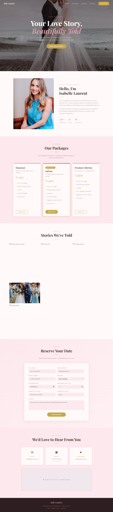

# Belle Lumière — Bridal Photography Booking Website


## About the Project

Belle Lumière is a single-page bridal photography studio website that lets couples discover packages, browse a curated gallery, and submit a booking enquiry — all without leaving the page. Built with zero dependencies (pure HTML, CSS, and vanilla JavaScript), it is fast, lightweight, and trivial to deploy anywhere.

The booking form posts as JSON to [FormSubmit](https://formsubmit.co/) and reveals an inline success message on submission, giving visitors a smooth, app-like experience with no backend code required.

## Screenshot



## Live Site

[https://linzhihong77-star.github.io/Claude-Learning/](https://linzhihong77-star.github.io/Claude-Learning/)

## File Structure

```
Claude-Learning/
├── index.html                   # Entire site — HTML, CSS, and JS inline
├── screenshot.png               # Full-page site screenshot
├── README.md                    # This file
├── CLAUDE.md                    # Guidance for Claude Code AI assistant
├── .nojekyll                    # Bypasses Jekyll on GitHub Pages
└── .github/
    └── workflows/
        └── deploy.yml           # GitHub Actions workflow → GitHub Pages
```

## Tech Stack

| Layer | Details |
|---|---|
| Markup | Semantic HTML5 |
| Styling | CSS custom properties, Grid, Flexbox, `@media` breakpoints at 600 px & 980 px |
| Scripting | Vanilla JS (`fetch`, `scrollIntoView`, scroll listener) |
| Fonts | Google Fonts — Playfair Display + Lato |
| Images | Unsplash CDN |
| Form backend | FormSubmit AJAX (JSON POST) |
| Hosting | GitHub Pages via GitHub Actions |

## Features

- **Hero** — Full-viewport banner with blush & gold overlay and a call-to-action
- **About** — Two-column photographer bio section
- **Packages** — Three tiers (Elopement · Full Day · Premium Collection) with one-click booking pre-fill
- **Gallery** — CSS Grid mosaic of six Unsplash bridal images with hover effects
- **Booking Form** — Posts as JSON to FormSubmit; hides form and reveals success message on submit
- **Contact** — Email, phone, Instagram, and Google Maps placeholder
- **Responsive** — Hamburger menu on mobile, fluid typography with `clamp()`

## How to Use

### View the live site

[https://linzhihong77-star.github.io/Claude-Learning/](https://linzhihong77-star.github.io/Claude-Learning/)

### Run locally

No install or build step needed:

```bash
python -m http.server 8080
```

Then open [http://localhost:8080/index.html](http://localhost:8080/index.html).

### Booking form setup

The form posts to `https://formsubmit.co/ajax/linzhihong77@gmail.com`. The **first** submission triggers a one-time activation email — click the link in that email before any bookings will be delivered.

## Colour Palette

| Token | Hex | Usage |
|---|---|---|
| Blush light | `#fce8ed` | Background tints |
| Blush mid | `#e8a0ae` | Borders, hover states |
| Blush dark | `#c07688` | Darker accents |
| Gold | `#c9a84c` | CTAs, dividers, icons |
| White | `#fffaf9` | Page background |
| Text dark | `#3a2e2e` | Body copy |
